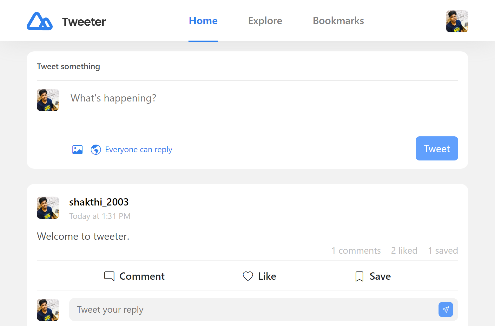

<!-- Please update value in the {}  -->

<h1 align="center">DevChallenges - Tweeter</h1>

   Solution for a challenge from  <a href="http://devchallenges.io" target="_blank">Devchallenges.io</a>.

  <h3>
    <a href="https://stirring-taffy-1efb41.netlify.app/">
      Demo
    </a>
     | 
    <a href="https://github.com/shakthi2003gh/Tweeter-website.git">
      Solution
    </a>
     | 
    <a href="https://devchallenges.io/challenges/rleoQc34THclWx1cFFKH">
      Challenge
    </a>
  </h3>

<!-- TABLE OF CONTENTS -->

## Table of Contents

- [Overview](#overview)
  - [Built With](#built-with)
- [Features](#features)

<!-- OVERVIEW -->

## Overview

### Built With

<!-- This section should list any major frameworks that you built your project using. Here are a few examples.-->

- [SCSS](https://sass-lang.com/)
- [React](https://reactjs.org/)
- [Redux](https://redux.js.org/)
- [Nodejs](https://nodejs.org/)
- [Expressjs](https://expressjs.com/)
- [Moongose](https://mongoosejs.com/)
- [AWS s3](https://aws.amazon.com/pm/serv-s3/?trk=b8b87cd7-09b8-4229-a529-91943319b8f5&sc_channel=ps&ef_id=CjwKCAjwgZCoBhBnEiwAz35RwqEXwaMA_0ObCq5vGEwJavyWrWTmC0NFz8rqF7oPXhsczG1LaaeW_xoCWPoQAvD_BwE:G:s&s_kwcid=AL!4422!3!536452784564!p!!g!!amazons3!11539706604!115473954674)

## Features

<!-- List the features of your application or follow the template. Don't share the figma file here :) -->

This application/site was created as a submission to a [DevChallenges](https://devchallenges.io/challenges) challenge. The [challenge](https://devchallenges.io/challenges/rleoQc34THclWx1cFFKH) was to build an application to complete the given user stories.
